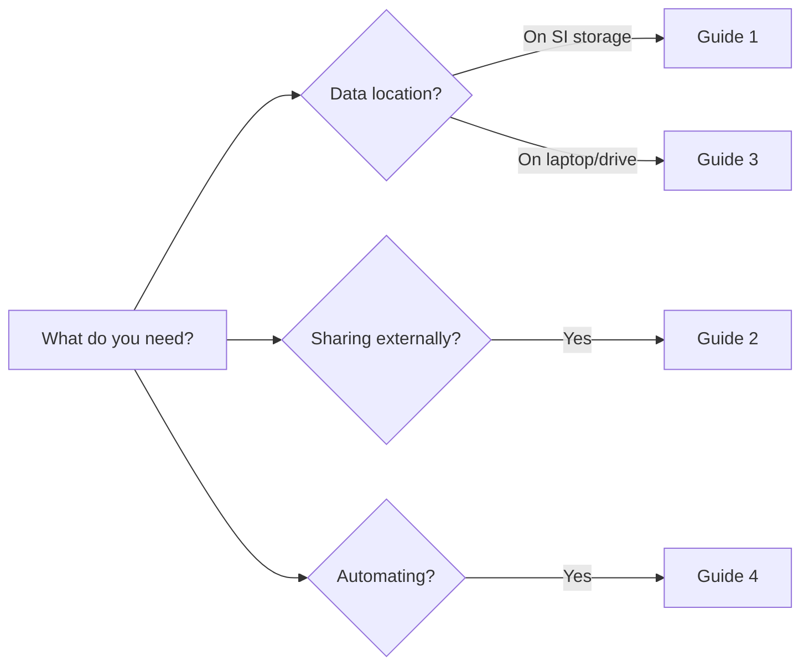

---
hide:
  - navigation
  - toc
---

# Globus at the Smithsonian

**All Smithsonian staff can log into Globus right now at [app.globus.org](https://app.globus.org) using their network credentials — no registration, VPN, or special setup required.**

---

## What is Globus?

Globus is a secure, high-performance data transfer platform that enables Smithsonian staff to move large datasets between storage systems and share data with external collaborators. Transfers happen server-to-server, so you can start a transfer and close your laptop.

**Smithsonian infrastructure includes:**

| Location | Purpose |
|----------|---------|
| Smithsonian Data Center | Hydra (HPC), DAMS NAS, unit network drives |
| STRI | Tropical research data workflows |
| SAO | Astrophysical research data |

---

## Guides

-   **Guide 1: Globus Basics**

    ---

    Start here if you're new. Learn to log in, navigate the interface, transfer files, and monitor progress.

    [Read the basics :material-arrow-right:](guide1-globus-basics.md)

-   **Guide 2: Sharing Data**

    ---

    Share with external collaborators. Create Guest Collections that give partners controlled access.

    [Learn to share :material-arrow-right:](guide2-sharing-data.md)

-   **Guide 3: Globus Connect Personal**

    ---

    Transfer from your laptop or external drive to institutional storage.

    [Set up your device :material-arrow-right:](guide3-globus-connect-personal.md)

-   **Guide 4: Advanced Features**

    ---

    Automate workflows with Sync, scheduled transfers, and Globus Flows.

    [Explore advanced features :material-arrow-right:](guide4-advanced-features.md)

---

## Quick Start

---

## Get Access

| Storage System | Contact |
|----------------|---------|
| Hydra (HPC) | [SI Service Portal](https://smithsonianprod.servicenowservices.com/si?id=sc_cat_item&sys_id=962e05331b96e05078932f41f54bcb3b) |
| DAMS NAS Staging | SI-Globus@si.edu |
| STRI | STRIhelp@si.edu |

---

## Support

**General Globus questions:** SI-Globus@si.edu

[Download Complete Guide (PDF)](https://github.com/YOUR-USERNAME/YOUR-REPO/raw/main/pdfs/globus-complete-guide.pdf){ .md-button }

---

*Maintained by ODI's Chief Data and AI Office*
