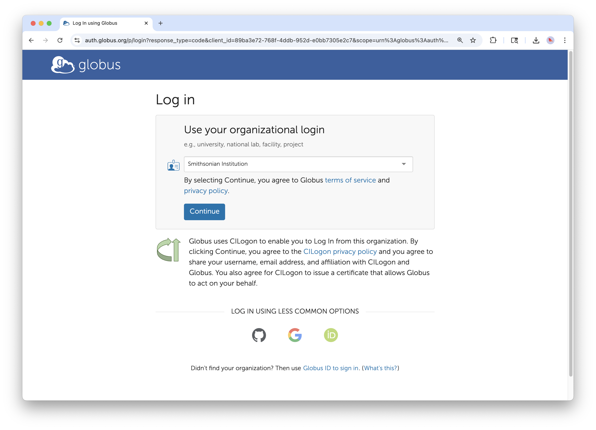
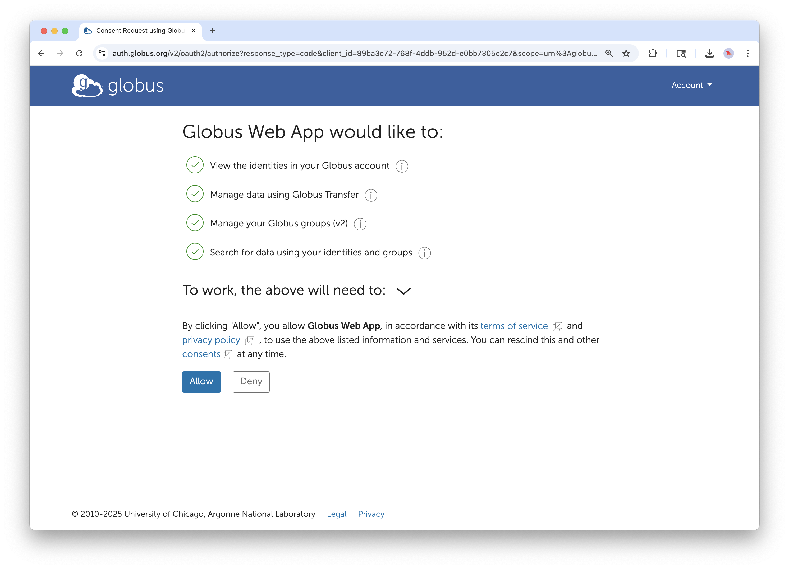
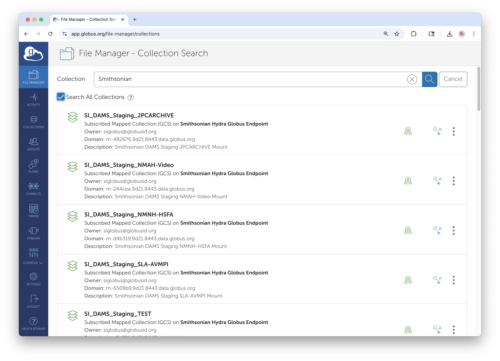
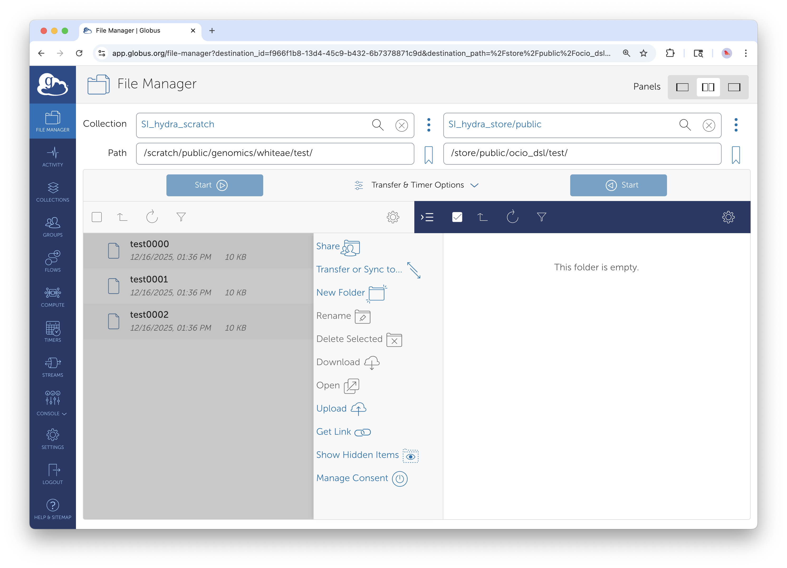
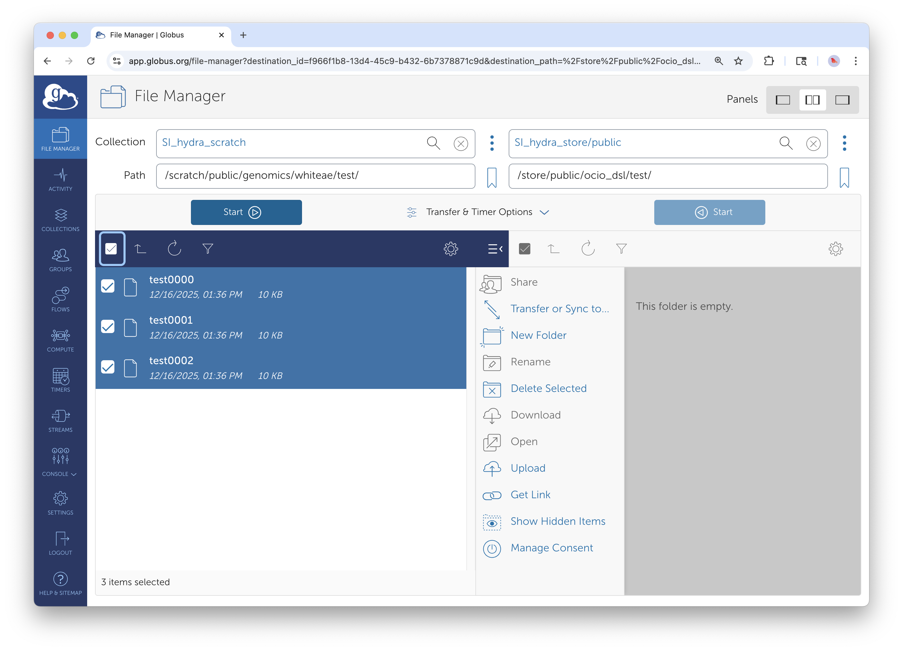
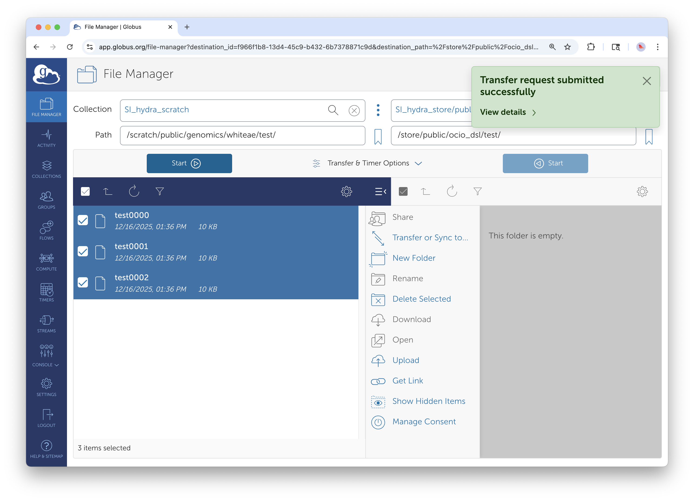
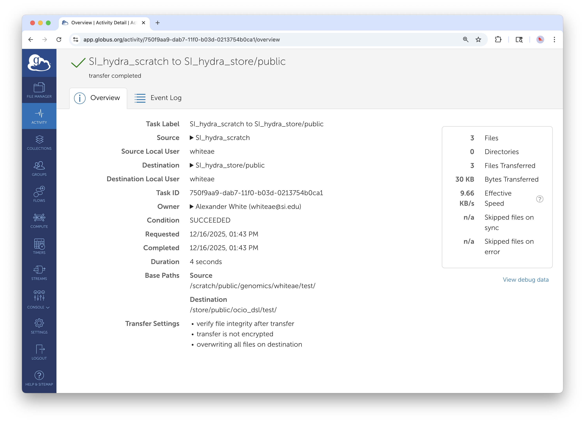

# Globus Basics and File Transfers

## Executive Summary

This guide introduces Smithsonian staff to Globus, a secure platform for transferring large datasets between storage systems. You'll learn how to log in with your Smithsonian credentials, navigate the web interface, transfer files between collections, and monitor your transfer activity. This foundational guide prepares you for more advanced Globus capabilities covered in our companion guides.

### What is Globus?

Globus is a data management service that enables fast, reliable transfer of large files between storage systems. Unlike email attachments or consumer cloud services, Globus is designed for large-scale data—think gigabytes to terabytes of genomic sequences, archival video collections, high-resolution imagery, or simulation outputs. Transfers happen server-to-server, so you can start a transfer and close your laptop; Globus handles the rest.

### Smithsonian Globus Infrastructure

Smithsonian maintains dedicated **Globus Data Transfer Nodes** at several locations:

- **Smithsonian Data Center** — Includes access to Hydra (high-performance computing cluster) storage, DAMS NAS storage, and certain unit managed network drives
- **STRI** (Smithsonian Tropical Research Institute) — For tropical research data workflows  
- **SAO** (Smithsonian Astrophysical Observatory) — For astrophysical research data

These institutional endpoints allow you to move data between Smithsonian systems and collaborate with partners worldwide.

## Prerequisites

### Account Requirements

| What You Need | How to Get It |
|---------------|---------------|
| **Smithsonian network account** | Your standard SI credentials (same as email login) |
| **Server account** (for Smithsonian storage access) | Contact system administrators (see below) |

**To access specific storage systems:**
- **Hydra**: [Request an HPC account on the SI Service Portal](https://smithsonianprod.servicenowservices.com/si?id=sc_cat_item&sys_id=962e05331b96e05078932f41f54bcb3b)
- **Hydra HPC Support:** SI-HPC@si.edu
- **DAMS NAS Workflows:** SI-Globus@si.edu
- **STRI users**: Contact STRIhelp@si.edu to request Globus Data Transfer Node Server access

Need more general support? Contact *SI-Globus@si.edu*

### Network Requirements

You can access Globus from anywhere with an internet connection—no VPN required for the web interface. However, you'll need appropriate server accounts to access data stored on Smithsonian systems.

## Getting Started: Logging Into Globus

### Step 1: Navigate to Globus

Open your web browser and go to **[app.globus.org](https://app.globus.org)**. You'll see the Globus login page.

*The Globus login page. Use the dropdown to search for Smithsonian Institution.*

### Step 2: Select Your Institution

Click the organization dropdown and search for "Smithsonian Institution." Select it from the list, then click **Continue**.

Globus uses the institution's existing login system—you'll authenticate with the same credentials you use for Smithsonian email and other institutional services.

### Step 3: Authenticate with Smithsonian Credentials

*Enter your Smithsonian network credentials when prompted.*

You'll be redirected to the Smithsonian login page. Enter your network username and password, and complete multi-factor authentication.

### Step 4: First-Time Login Setup

If this is your first time using Globus with your Smithsonian credentials:

1. You'll see a welcome message confirming successful authentication
2. If you've used Globus before with a different login (personal Google account, another institution), you can link accounts to maintain a unified history
3. For most users, simply click **Continue** to proceed

### Step 5: Grant Application Permissions

*Globus requests permission to access data on your behalf. Click Allow to proceed.*

Globus will ask for permission to perform actions on your behalf—searching collections, managing transfers, and accessing your data. Review the permissions and click **Allow** to continue to the File Manager.

## Navigating the Globus Interface

After logging in, you'll land in the **File Manager**—your primary workspace for browsing and transferring files.

### The File Manager Overview

*The File Manager interface. The left sidebar provides navigation; the main area displays your current collection.*

**Left Sidebar Navigation:**
- **File Manager** — Browse collections and initiate transfers (where you'll spend most of your time)
- **Activity** — Monitor ongoing and completed transfers
- **Collections** — View and manage collections you own or have access to
- **Groups** — Manage group memberships for collaborative access
- **Settings** — Configure preferences and manage your Globus identity

**Main Panel:**
- **Collection** field — Search for and select data collections
- **Path** field — Shows your current directory location within the collection
- **File listing** — Browse files and folders in the selected collection

### Finding Collections

Collections are the fundamental unit in Globus. They represent accessible storage locations. To work with any data, you first need to find and select a collection.

*Click in the Collection field and type to search. Results appear as you type.*

**To find a Smithsonian collection:**

1. Click in the **Collection** search field
2. Search for **"Smithsonian"** to see all collections managed on Smithsonian Data Transfer Nodes
3. Browse the results to find the collection matching your storage system (Hydra, DAMS Staging NAS, STRI, SAO, etc.)
4. Select the appropriate collection from the search results

**Tip:** There are dozens of Smithsonian-managed collections. If you're unsure which collection corresponds to your storage system, contact SI-Globus@si.edu for guidance.

### Browsing Files and Folders

*After selecting a collection, you can browse directories and files.*

Once you've selected a collection:

- **Double-click folders** to navigate into them
- Use **"up one folder"** to move to the parent directory
- The **Path** field shows your current location—you can also type paths directly
- Click **refresh list** to update the view if files have changed

## Transferring Files Between Collections

The core Globus workflow involves transferring files from a **source** collection to a **destination** collection. Globus uses a two-panel interface that makes this intuitive.

### Step 1: Open the Two-Panel View

*Click the Panels button in the top right to enable two-panel view for transfers.*

In the top-right corner of the File Manager, you'll see **Panels** options. Click to enable the two-panel view, which displays source and destination side by side.

### Step 2: Select Your Source Collection

In the **left panel**, search for and select the collection containing the files you want to transfer. Navigate to the directory with your data.

*The left panel shows your source collection. Browse to the files you want to transfer.*

### Step 3: Select Your Destination Collection

In the **right panel**, search for and select where you want the files to go. Navigate to the target directory.

*Set up both panels: source on the left, destination on the right.*

### Step 4: Select Files and Start Transfer

*Select files using checkboxes, then click Start to initiate the transfer.*

1. In the source panel (left), **check the boxes** next to files or folders you want to transfer
2. Selected items will be highlighted
3. Click the **Start** button (blue button with arrow) above the source panel
4. You'll see a confirmation that your transfer request was submitted

*Transfer submitted confirmation. Click "View details" to monitor progress.*

**Important:** You can now close your browser or shut down your laptop. Globus handles the transfer server-to-server, you don't need to stay connected.

### Understanding Transfer Direction

The **Start** button appears on both panels. The button you click determines the transfer direction:

- Click **Start** on the **left panel** → Transfer from left to right
- Click **Start** on the **right panel** → Transfer from right to left

The blue "Start" button with the play icon initiates the transfer; the teal button with the clock icon is for scheduling (covered in Guide 4: Advanced Features).

## Monitoring Transfer Progress

### Viewing Active and Completed Transfers

*The Activity page shows all your transfers. Click the arrow to view details.*

Click **Activity** in the left sidebar to see your transfer history. This page shows:

- **Active transfers** — Currently in progress
- **Completed transfers** — Successfully finished
- **Failed transfers** — Transfers that encountered errors

You can filter by status (Active, Succeeded, Failed) and search by collection name.

### Transfer Details

*Transfer details show complete information: files transferred, speed, and any errors.*

Click on any transfer to see detailed information:

- **Task Label** — Description of the transfer
- **Source and Destination** — The collections involved
- **Condition** — Current status (Active, Succeeded, Failed)
- **Files/Bytes Transferred** — Progress information
- **Duration** — How long the transfer took
- **Effective Speed** — Transfer rate achieved

The **Event Log** tab provides a timeline of transfer events, useful for troubleshooting.

## Handling Authentication Requests

When accessing certain collections, you may see an "Authentication/Consent Required" message.

*Some collections require additional authentication. Click Continue to proceed.*

This happens when:
- You're accessing a collection for the first time
- Your authentication has expired
- The collection requires specific credentials

Click **Continue** and follow the prompts to authenticate. This is normal and ensures secure access to protected data.

## Troubleshooting Common Issues

### Transfer Failures

**Issue: Transfer fails with "Permission Denied"**
- **Cause:** You don't have appropriate access to the source or destination
- **Solution:** Verify you have an account on the relevant storage system; contact system administrators if needed
- **For Hydra/DAMS:** SI-HPC@si.edu
- **For DAMS Staging:** SI-Globus@si.edu
- **For STRI:** STRIhelp@si.edu

**Issue: Transfer stalls or times out**
- **Cause:** Network interruption or endpoint temporarily unavailable
- **Solution:** Globus automatically retries failed transfers. Check the Activity page—if the transfer is still "Active," it's working. If it failed, you can restart it.

**Issue: "Endpoint not found" or collection not visible**
- **Cause:** The endpoint may be offline, or you may not have access
- **Solution:** Try searching for the collection again; contact SI-Globus@si.edu if the issue persists

### Login Problems

**Issue: Can't find Smithsonian Institution in the organization list**
- **Solution:** Try searching for "Smithsonian" rather than specific unit names; ensure you're on app.globus.org

**Issue: Login succeeds but collections show "Access Denied"**
- **Cause:** You're authenticated to Globus but don't have an account on the underlying storage system
- **Solution:** Request appropriate server access (Hydra, STRI, etc.) from system administrators

### Performance Issues

**Issue: Transfers are slow**
- **Cause:** Large number of small files, network congestion, or endpoint load
- **Solution:** For many small files, consider compressing into an archive first; schedule large transfers during off-peak hours

## Next Steps: Building on the Basics

Now that you understand Globus fundamentals, explore these companion guides based on your needs:

### Guide 2: Creating Guest Collections for External Collaboration
**For:** Staff who need to share data with collaborators outside Smithsonian

Learn how to create Guest Collections that give external partners controlled access to specific directories without requiring them to have Smithsonian accounts.

### Guide 3: Globus Connect Personal
**For:** Staff with data on laptops, workstations, or external hard drives

Install Globus Connect Personal to create a collection on your personal device, enabling transfers between your laptop and institutional storage. This is essential for users who want to transfer data from workstations or external drives to institutionally managed storage like DAMS, Hydra, or STRI's NAS.

### Guide 4: Advanced Globus Features
**For:** Power users ready to automate their data workflows

Explore advanced capabilities: Sync (instead of Transfer) for keeping directories synchronized, scheduled and recurring transfers, and Globus Flows for automated multi-step workflows.

## Quick Reference

### Key URLs
- **Globus Web App:** [app.globus.org](https://app.globus.org)
- **Globus Documentation:** [docs.globus.org](https://docs.globus.org)

### Smithsonian Support Contacts
- **General Globus Support:** SI-Globus@si.edu
- **Hydra HPC Support:** SI-HPC@si.edu
- **DAMS NAS Workflows:** SI-Globus@si.edu
- **STRI Data Transfer Server:** STRIhelp@si.edu

### Glossary

| Term | Definition |
|------|------------|
| **Collection** | A storage location accessible through Globus (formerly called "endpoint") |
| **Endpoint** | The server or system hosting one or more collections |
| **Guest Collection** | A shared folder you create to give others access to your data |
| **Mapped Collection** | An institutional collection that maps to underlying storage |
| **Transfer** | A one-time copy of files from source to destination |
| **Sync** | A transfer that only copies new or changed files |

---

*For technical support with Globus, contact SI-Globus@si.edu. For questions about specific storage system access, contact the appropriate system administrators listed above.*
