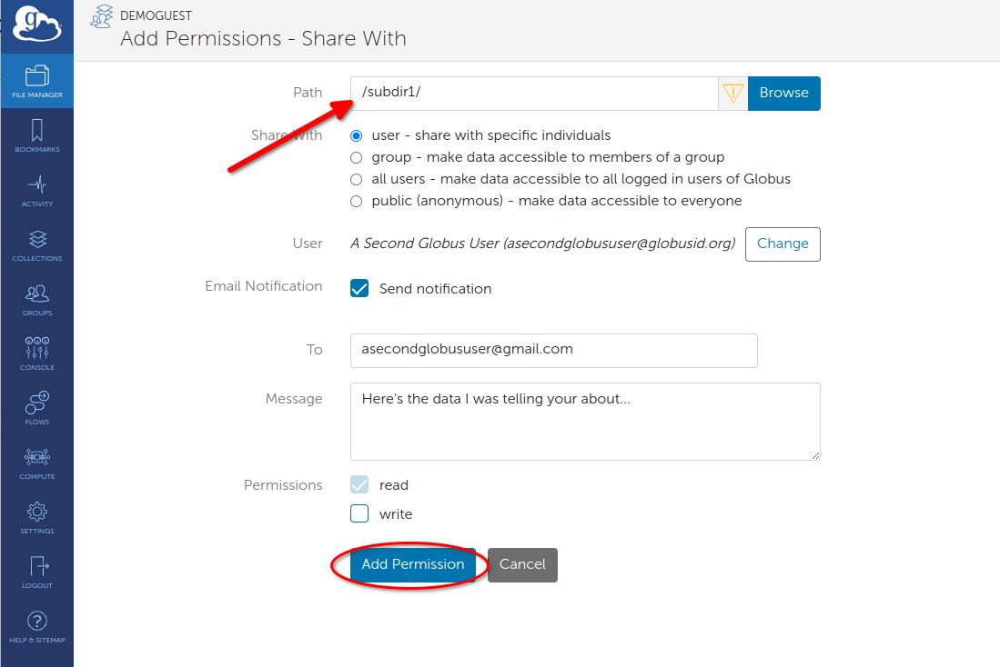
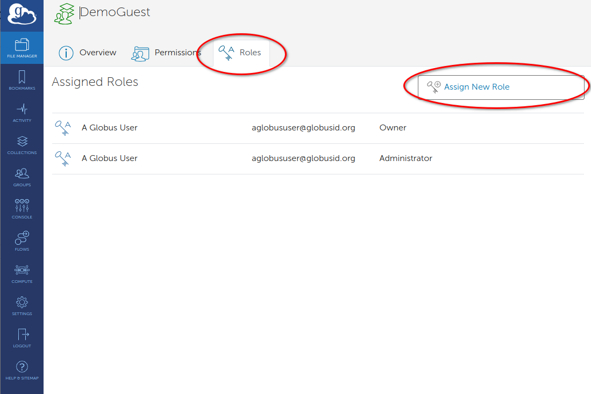
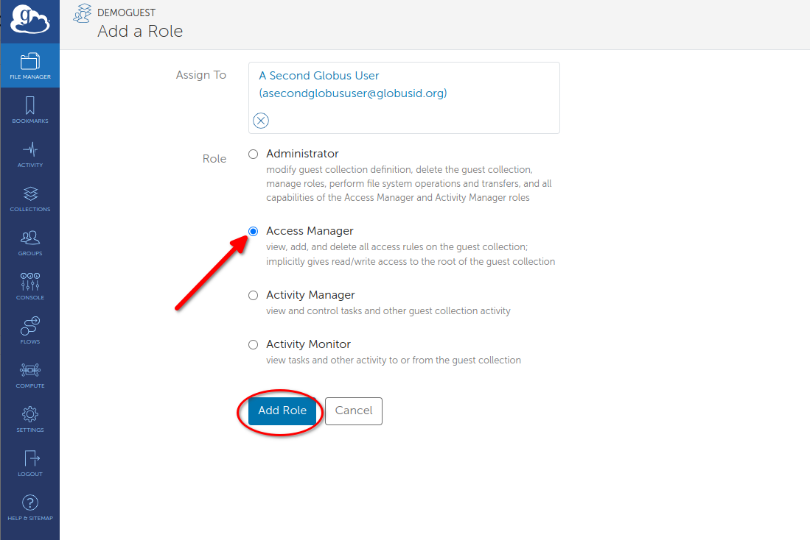

# Creating Guest Collections for External Collaboration

This guide provides step-by-step instructions for Smithsonian researchers to create **Guest Collections** in Globus, enabling secure data sharing with external collaborators who don't have access to Smithsonian storage systems. Guest Collections act as a bridge, using the data owner's credentials to provide controlled access to specific directories.

### Smithsonian Globus Infrastructure

While many large-volume transfers involve the Hydra high-performance computing cluster, researchers can also leverage dedicated **Globus Data Transfer Nodes** located at:
- **Smithsonian Data Center** (includes Hydra and DAMS NAS storage)
- **STRI** (Smithsonian Tropical Research Institute)
- **SAO** (Smithsonian Astrophysical Observatory)

### Example Use Cases

Many Smithsonian researchers use Globus to share large datasets with external collaborators, particularly those requiring access to raw data files that are too large for email or cloud storage:

- A collaborative team at NMNH and STRI uses Globus to transfer pollen images generated on microscopes at NMNH to STRI, where they are analyzed and shared with external collaborators who provide taxonomic expertise by annotating the images according to their specialized knowledge of pollen identification.

- The Center for Conservation Genomics at NZCBI uses Globus to share genomic data externally with research partners around the world.

## Globus Access and Account Requirements

**TL;DR: Your Smithsonian account gives you access to Globus. To share data, you also need an account on the server where your data lives. When you create a Guest Collection, it uses YOUR server permissions to let external collaborators access your data - they don't need their own server accounts.**

| Access Type | What It Provides | Requirements |
|-------------|------------------|--------------|
| **Globus Web Application** | Interface to manage transfers, view activity, browse collections | Smithsonian network account  |
| **Creating Guest Collections** | Ability to share your data with external collaborators | Smithsonian network account + user account on the specific server hosting your data |
| **Accessing Shared Guest Collections** | Read/write data in collections shared with you | Globus account only (uses collection owner's server permissions) |

**Important Note:** While you can access the Globus web application interface with just your Smithsonian network account, you need user accounts on the specific storage systems (Hydra, STRI servers, etc.) to view and work with Collections containing data stored on those systems. Without the underlying storage access, Collections will appear as inaccessible in the Globus interface.

## Prerequisites

### For Data Owners (Sharing Data)
- [ ] Active Smithsonian network account 
- [ ] User account on the server hosting your data:
  - **Smithsonian Data Center users** (Hydra, DAMS NAS): Contact Hydra Sys Admins (SI-HPC-Admin@si.edu) for an account
  - **STRI users**: Contact STRI Sys Admins (STRIhelp@si.edu) for Data Transfer Server account
- [ ] Data organized in a shareable directory structure (best practices outlined below)
- [ ] Evaluate your data's sensitivity (note: PII should not be transferred using Globus)

### For Data Recipients (Accessing Shared Data)
- [ ] Globus account (free institutional or personal account)
- [ ] Valid email address for sharing notifications

**Note**: Recipients do not need accounts on the underlying storage systems. The Guest Collection uses the data owner's permissions to provide access.

### Network Requirements
Once data is deposited in a Smithsonian-managed collection, all Globus actions can be managed from the web application (app.globus.org) without being required to be on the Smithsonian network or VPN.

## Creating Your Guest Collection

Think of a Guest Collection as creating a secure "window" into your data. You maintain full control over what's shared and who can access it, while your collaborators can use their existing Globus accounts to access, download, or even upload files to your shared space.

### Step 1: Locate Your Data

*Access your institutional collection through the File Manager interface. Note the "Globus Tutorial Collection 1" dropdown and "Directory_To_Share" folder selection.*

Log into the Globus web interface and navigate to the File Manager. Search for the collection where your data are housed - for example, "Globus Tutorial Collection 1" shown in the interface. Browse to find the directory containing the data you want to share.

The key decision here is choosing the right directory level. You can share an entire project folder or drill down to specific subdirectories. Consider what your collaborators actually need access to - sharing at too high a level might expose data they don't need to see, while sharing too narrowly might require creating multiple Guest Collections later.

### Step 2: Initiate Guest Collection Creation

*Select the folder you want to share (blue highlighting shows selection) and click the Share button (red circle) from the action menu.*

Once you've located the directory to share, select it using the checkbox. You'll see it highlighted in blue. Click the "Share" button from the action menu on the right side of the interface.

From the sharing options, select "Add Guest Collection." This creates a new access point that external users can connect to, separate from your main Smithsonian collection. Think of this as creating a dedicated "front door" for your collaborators that only opens to the specific data you want to share.

*Alternative method: From the collection overview, click 'Add Guest Collection' (red circle) to begin sharing process.*

### Step 3: Configure Collection Identity

*Configure your guest collection with descriptive information and security settings.*

When creating the Guest Collection, you'll configure several important settings:

**Display Name**: Choose something descriptive. "DemoGuest" works for testing, but for real collaborations, use names like "PollenAnalysisProject2025" or "GenomicsData_SmithLab." Your collaborators will see this name, and it helps them understand what they're accessing.

**Description**: Explain what the data contains, any important usage guidelines, and perhaps how it relates to your collaboration. For example: "High-resolution pollen microscopy images from Costa Rica field sites. Please download images, add taxonomic annotations to the provided spreadsheet, and return completed annotations via email."

**Directory Path**: This confirms exactly which directory you're sharing. Double-check this carefully - you can restrict access further later, but you can't expand beyond what you select here without creating a new Guest Collection.

**Keywords**: Add searchable terms that help with discoverability if you're managing multiple Guest Collections. Terms like your project name, institution names, or data types work well.

Click "Create Collection" to establish this new sharing endpoint.

### Step 4: Add Your Collaborators

*Access permission management from your newly created guest collection using the "Add Permissions — Share With" button (red circle).*

Now comes the crucial step of defining who can access your data and what they can do with it. Click "Add Permissions — Share With" to begin configuring access.

**Choosing Your Sharing Scope:**

Most research collaborations use "User" sharing, where you specify individuals by their email addresses or institutional identifiers. This gives you precise control over who has access.

"Group" sharing works well if your collaborator's institution has pre-defined research groups in Globus, but this is less common for external collaborations.

Do not select "All Users" or "Public".

*Configure basic user permissions for root directory access. Note the "user" button selection (red arrow), Email Notification checkbox (red arrow), and "Add Permission" button (red circle).*

**Configuring User Permissions:**

For each collaborator, you can specify several settings:

**Path Access**: The default is "/" which gives access to everything in your Guest Collection. However, you can restrict access to specific subdirectories. For example, if your Guest Collection contains both raw data and preliminary analysis, you might give collaborators access only to "/rawdata/" initially, then later grant access to "/analysis/" as the project progresses.

**Read vs. Write Permissions**: 
- **Read**: Allows downloading and viewing files. This is appropriate when you're sharing datasets for analysis.
- **Write**: Allows uploading, modifying, and deleting files. DO NOT ENABLE WRITE ACCESS. 

**Email Notifications**: Enable this and customize the message. A message like "Here's access to the pollen image dataset we discussed. Please see the README file for analysis instructions."

**Advanced Access Control:**

*Advanced: Restrict access to specific subdirectories by modifying the Path field. The red arrow shows "/subdir1/" limiting access to only that subdirectory.*

For enhanced customization, you can limit access to specific subdirectories by changing the Path field from `/` to `/subdir1/` or other specific paths. This is particularly useful when your Guest Collection contains multiple types of data but you only want to share specific portions with certain collaborators.

## Managing Ongoing Collaborations

### Understanding Collection Roles

*Manage the use of Guest Collections with the Roles tab (red circle). Click "Assign New Role" (red circle) to add administrative responsibilities.*

For long-term collaborations, you might want to delegate some management responsibilities to other individuals in your Lab. Globus provides several administrative roles. These should only be assigned to Smithsonian staff who you work with and who understand how Globus works.

**Administrator**: Has full control over the Guest Collection, including the ability to delete it. Only assign this to trusted, long-term collaborators who understand Globus well.

**Access Manager**: Can add and remove other users' permissions, but can't delete the collection itself. This is useful for project coordinators who need to manage team access.

**Activity Manager**: Can monitor who's transferring what data, which helps with project coordination and troubleshooting.

*Assign specific roles to collaborators based on their responsibilities. The red arrow shows Access Manager selection, with "Add Role" button (red circle) to finalize assignment.*

Most collaborations don't need these roles initially, but they become valuable for larger, longer-term projects.

### Monitoring Collection Usage

The Activity section shows you what's happening with your shared data - who's downloading what, when transfers occur, and if there are any access problems. This is valuable for understanding how actively your collaboration is proceeding and for troubleshooting if collaborators report problems.

### Lifecycle Management

Research collaborations have natural endpoints. When a project concludes, or when certain collaborators no longer need access, remove their permissions through the Permissions tab. This isn't just good security practice - it also helps keep your Guest Collection organized and ensures you're only supporting active collaborations.

## Troubleshooting Sharing Issues

### Access Problems

**Issue: "Access Denied" when accessing shared collection**

*Verify that both read permissions are enabled (checkboxes) and that the collaborator has been properly notified.*

- **Cause**: Permission not properly configured in Guest Collection, or data owner lacks sufficient permissions on underlying storage
- **Solution**: Verify permission settings in Guest Collection; ensure data owner has appropriate access to shared directories
- **Prevention**: Test Guest Collection access with known collaborators; verify data owner permissions before sharing

**Issue: Collection not visible to collaborator**
- **Cause**: Permission not properly configured or email notification not received
- **Solution**: Re-send invitation through permission management; verify user identity
- **Prevention**: Always enable email notifications; test sharing with known users first

## Collaboration Best Practices

### Data Organization
- **Share Only What's Necessary**: Limit access to specific directories required for collaboration rather than providing broad access
- **Clear Directory Structure**: Use intuitive folder hierarchies like shown in the file listings
- **Comprehensive Documentation**: Include README files and metadata
- **Access Boundaries**: Use path restrictions to prevent unnecessary directory access

### Security Considerations
- **Principle of Least Privilege**: Grant minimum required access
- **Review Collaborator Access**: Remove permissions when no longer needed
- **Data Sensitivity**: Do not share personally identifiable information (PII) with Globus

### Using Globus for Internal Smithsonian Collaboration

While this guide focuses on external collaboration, these same tools and techniques can be used effectively for sharing data between Smithsonian departments, research units, centers, and institutes. Internal collaborations may have simplified account management since all parties already have Smithsonian network access, but the same principles of organized sharing, clear permissions, and proper access management apply.

## Support and Additional Resources

### Getting Help
- **SI-Globus@si.edu**: General Globus support and troubleshooting
- **SI-HPC-Admin@si.edu**: Hydra account creation and system-specific issues
- **STRIhelp@si.edu**: STRI Data Transfer Server account creation and support
- **Globus Documentation**: Comprehensive platform [guides and tutorials](https://docs.globus.org/)

---

*For technical support with Globus collections and data access, contact SI-Globus@si.edu. For questions about account creation or specific systems access, contact the appropriate system administrators listed above.*