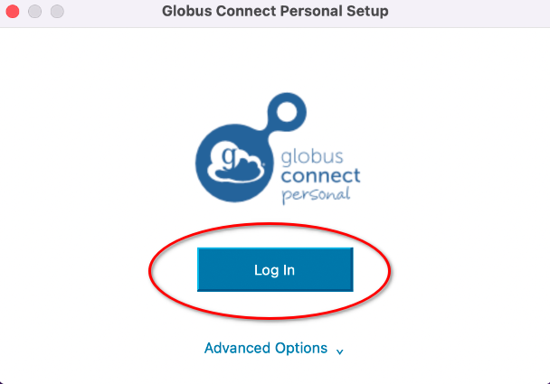
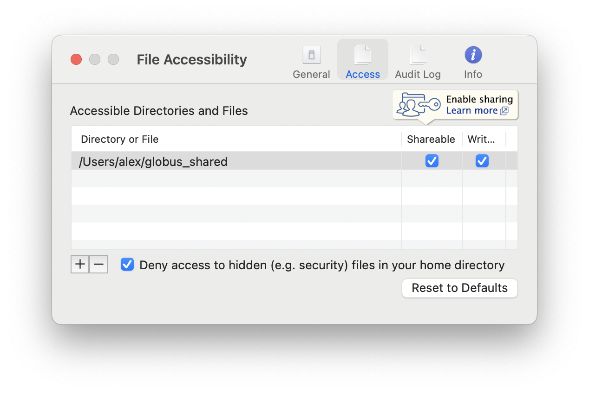
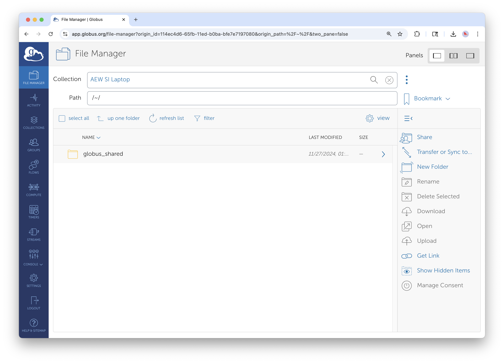
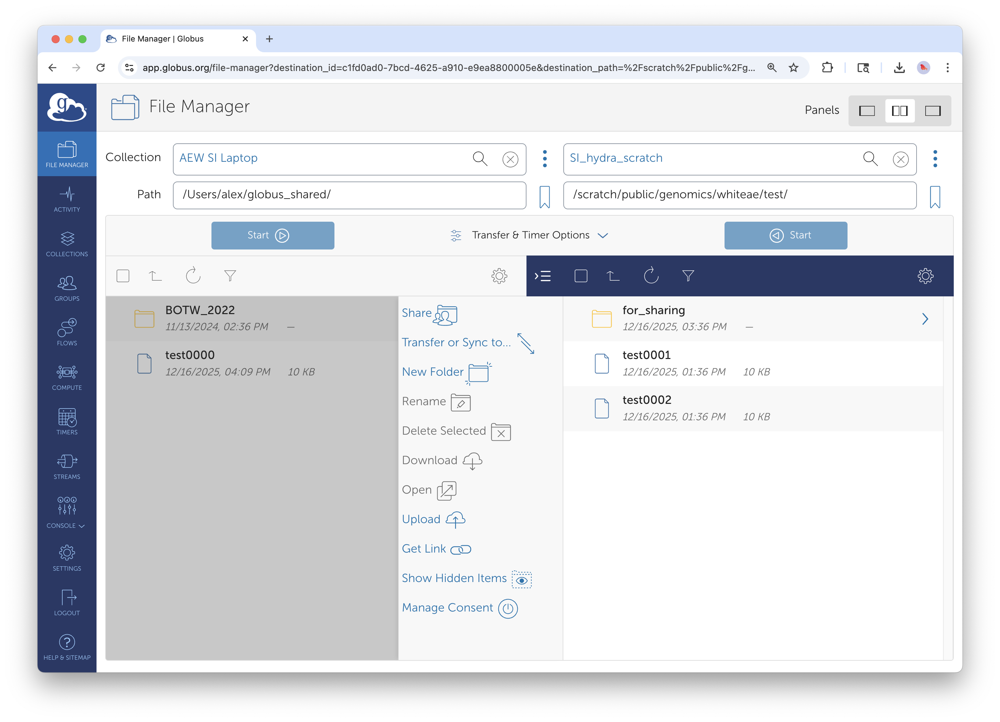

# Globus Connect Personal

## Executive Summary

This guide shows Smithsonian staff how to install and configure **Globus Connect Personal**, a lightweight application that turns your laptop, workstation, or external hard drive into a Globus collection. Once set up, you can transfer files directly between your personal device and Smithsonian storage systems. This workflow is ideal for uploading fieldwork data, migrating archival collections, syncing project outputs, or backing up local files to institutional storage.

### When to Use Globus Connect Personal

Globus Connect Personal bridges the gap between personal devices and institutional infrastructure. Common scenarios include:

- **Returning from fieldwork** with terabytes of images, audio recordings, or sensor data on an external drive
- **Migrating archival collections** from external hard drives to DAMS or other institutional storage
- **Working on a laptop** and needing to move outputs to Hydra for further processing
- **Downloading shared datasets** from collaborators directly to your workstation

Unlike browser-based uploads (which are limited and unreliable for large files), Globus Connect Personal uses the same robust transfer engine as server-to-server transfers, with automatic retry, integrity verification, and no size limits.

## Prerequisites

### What You Need

| Requirement | Details |
|-------------|---------|
| **Globus account** | Log in at least once via app.globus.org with your Smithsonian credentials |
| **Personal device** | Windows, macOS, or Linux computer where you want to install Globus Connect Personal |
| **Storage to connect** | Internal drive, external hard drive, or network-attached storage |

## Installing Globus Connect Personal on a Smithsonian Managed Computer

### Step 1: Navigate to the Self Service Application

Open the "Self Service" or "Software Center" application on your machine. This application comes pre-installed on Smithsonian managed computers.

*The Smithsonian "Self Service" login. Authenticate with your SI credentials.*

### Step 2: Run the Installer

In the main self service page you will likely see the Globus Connect Personal application. Search for "globus" if it is not immediately availble. Select the application to install it on your machine.

*Globus Connect Personal is available via the self service software center on both Windows and macOS.*

## Installing Globus Connect Personal on a Personal Device

### Step 1: Download the Installer

Go to [globus.org/globus-connect-personal](https://www.globus.org/globus-connect-personal) and download the installer for your operating system.

*The Globus Connect Personal download page. Select your operating system.*

### Step 2: Run the Installer

**On Windows:**
1. Run the downloaded `.exe` file
2. Follow the installation wizard prompts
3. The application will launch automatically when complete

**On macOS:**
1. Open the downloaded `.dmg` file
2. Drag Globus Connect Personal to your Applications folder
3. Launch from Applications (you may need to approve it in Security & Privacy settings)

**On Linux:**
1. Extract the downloaded `.tgz` archive
2. Run the `globusconnectpersonal` script
3. Follow terminal prompts to complete setup

### Step 3: Log In and Create Your Collection

Launch the application. When Globus Connect Personal launches, it will open a browser window for authentication.

*Globus Connect Personal prompts you to log in and authorize the application.*

1. Log in with your Smithsonian credentials (same as the web interface)
2. Grant the requested permissions
3. You'll be prompted to name your collection

**Choosing a Collection Name:**

Pick something descriptive that you'll recognize later. Good examples:
- "JSmith-MacBook-Pro"
- "FieldLaptop-2025"
- "Lab-Workstation-NMNH"

Avoid generic names like "My Computer"—if you set up multiple devices, you'll want to distinguish them.

### Step 4: Configure Accessible Folders

By default, Globus Connect Personal only exposes your home directory (see security note below). You'll want to instead add other locations, especially external drives.

*The Preferences panel lets you control which folders are accessible via Globus.*

**To add folders:**

1. Open Globus Connect Personal preferences (right-click the system tray/menu bar icon)
2. Go to the **Access** tab
3. Click the **+** button to add folders
4. Navigate to the folder or drive you want to share
5. Choose whether to allow **Writable** access (allows uploads to this location)

**Common folders to add:**
- External hard drives (e.g., `/Volumes/FieldData` on Mac, `E:\` on Windows)
- Project folders outside your home directory
- Network drives mounted on your computer

**Security note:** Only add folders you actually need to transfer. The principle of "least access required" applies. To remove a folder, select it and click the **-** button. It is recommended to remove your home directory and only add specific folders you need.

### Step 5: Verify Your Collection is Online

Once configured, your collection should appear in the Globus web interface.

*Your personal collection now appears in the File Manager, ready for transfers.*

1. Go to [app.globus.org](https://app.globus.org)
2. In the File Manager, search for your collection name
3. You should see your configured folders

If your collection doesn't appear, check that Globus Connect Personal is running (look for the icon in your system tray or menu bar, the same location where you might find your wifi connection).

## Transferring Data To and From Your Device

With Globus Connect Personal running, transfers work exactly like server-to-server transfers covered in Guide 1.

### Use Case: Uploading Data to Storage at the Smithsonian Data Center

A common workflow: you've returned from the field with an external drive full of data and need to upload it to Hydra for processing. Another scenario: you have project files on an external drive that need to be uploaded to DAMS Staging.

*Two-panel view: personal collection on the left, in this case, Hydra on the right.*

1. Open the two-panel view in File Manager
2. **Left panel:** Select your personal collection, navigate to the external drive
3. **Right panel:** Select the Smithsonian managed collection, navigate to your destination directory
4. Select files/folders on the left, click **Start**

The transfer will proceed even if you close the browser—but **keep Globus Connect Personal running** until the transfer completes.

### Downloading Shared Data to Your Laptop

If a collaborator has shared a Guest Collection with you, you can download directly to your laptop:

1. **Left panel:** Navigate to the shared Guest Collection
2. **Right panel:** Select your personal collection
3. Select files on the left, click **Start**

This is much more reliable than browser downloads for large datasets.

## Managing Globus Connect Personal

### Understanding the System Tray Icon

Globus Connect Personal runs in the background and shows a small icon in your system tray (Windows) or menu bar (macOS).

| Icon State | Meaning |
|------------|---------|
| **Solid/connected** | Your collection is online and accessible |
| **Greyed out/paused** | Transfers are paused; collection is offline |
| **Spinning/active** | A transfer is currently in progress |

Right-click the icon for options: Pause, Preferences, Web Dashboard, Quit.

### Pausing and Resuming

You can pause Globus Connect Personal when you don't need it—for example, when on a slow connection or to preserve battery life.

**To pause:** Right-click the icon and select **Pause**

**To resume:** Right-click and select **Unpause** or **Resume**

While paused, your collection is offline and transfers cannot proceed. Any pending transfers will resume automatically when you unpause.

### Updating the Application

Globus Connect Personal occasionally requires updates. You'll see a notification when an update is available. It's good practice to keep the application current for security and compatibility.

## Working with External Drives

### Connecting a New Drive

When you connect an external drive for the first time:

1. Mount the drive normally on your computer
2. Open Globus Connect Personal preferences
3. Add the drive's mount point to your accessible folders
4. The drive will now appear as a subfolder in your collection

**On macOS:** External drives typically mount at `/Volumes/DriveName`

**On Windows:** External drives appear as drive letters like `D:\` or `E:\`

### Drive Naming Considerations

If you regularly swap between multiple external drives, the folder structure in Globus will change based on which drive is connected. Consider:

- Using consistent drive names when formatting
- Creating a dedicated "incoming data" folder structure on each drive
- Documenting your drive naming conventions for your colleagues or lab group

### Safely Disconnecting

Before physically disconnecting an external drive:

1. Ensure no transfers are in progress (check the Activity page)
2. Pause Globus Connect Personal (optional but recommended)
3. Eject the drive using your operating system's normal process

## Troubleshooting

### Connection Issues

**Issue: Collection shows as "offline" in the web interface**
- **Cause:** Globus Connect Personal isn't running, or is paused
- **Solution:** Check for the application icon; restart if needed; verify you're connected to the internet

**Issue: Collection is online but folders are empty**
- **Cause:** Folder permissions not configured in Globus Connect Personal
- **Solution:** Open Preferences → Access tab → verify the folders you need are listed

**Issue: "Permission denied" when transferring to your device**
- **Cause:** The destination folder isn't marked as Writable in preferences
- **Solution:** Edit the folder in Access preferences and enable Writable

### Transfer Issues

**Issue: Transfer fails when laptop goes to sleep**
- **Cause:** Globus Connect Personal stops when the computer sleeps
- **Solution:** Adjust your power settings to prevent sleep during transfers, or use a desktop workstation for large transfers

**Issue: Transfer is very slow**
- **Cause:** Home internet connection, WiFi limitations, or VPN overhead
- **Solution:** Use a wired connection if possible; avoid VPN for Globus transfers (it's not required); consider transferring large datasets from your office rather than home

**Issue: External drive not visible in Globus**
- **Cause:** Drive not added to accessible folders, or not mounted
- **Solution:** Verify the drive is mounted and visible in your file explorer; add the mount point in Globus Connect Personal preferences

### Authentication Issues

**Issue: "Login required" error when collection was working before**
- **Cause:** Authentication credentials have expired
- **Solution:** Open the Globus Connect Personal menu and select "Log In" or visit the Web Dashboard to re-authenticate

## Best Practices for Large Transfer Projects

Whether you're uploading fieldwork data, migrating archival collections, or consolidating project files, these practices will help ensure successful transfers.

### Before You Start

- Install and test Globus Connect Personal on your laptop or workstation
- Verify you can successfully transfer a small test file to your destination
- Add your external drive mount points in advance
- Confirm you have the necessary account access on destination systems

### During Transfer

- Connect to a reliable, fast network before starting large transfers
- Keep your computer plugged in and prevent sleep
- Start the transfer and monitor initial progress before walking away
- Use the Activity page to verify completion

## Next Steps

Now that you can transfer data to and from your personal devices, explore these related guides:

**Guide 2: Creating Guest Collections** — Share data with external collaborators by creating Guest Collections on Smithsonian storage systems.

**Guide 4: Advanced Features** — Set up recurring transfers to automatically sync data between your laptop and institutional storage.

## Quick Reference

### Key URLs
- **Download:** [globus.org/globus-connect-personal](https://www.globus.org/globus-connect-personal)
- **Web Interface:** [app.globus.org](https://app.globus.org)
- **Documentation:** [docs.globus.org/how-to/globus-connect-personal](https://docs.globus.org/how-to/globus-connect-personal/)

### Smithsonian Support Contacts
- **General Globus Support:** SI-Globus@si.edu
- **Hydra HPC Support:** SI-HPC@si.edu
- **DAMS NAS Workflows:** SI-Globus@si.edu
- **STRI Data Transfer Server:** STRIhelp@si.edu

---

*For technical support with Globus Connect Personal, contact SI-Globus@si.edu. For issues with destination storage systems, contact the appropriate system administrators listed above.*
