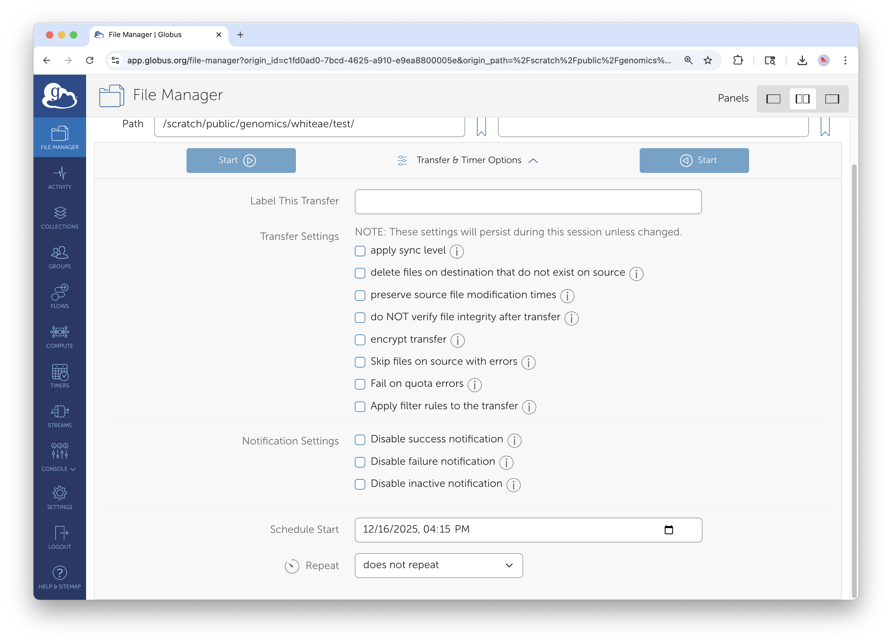
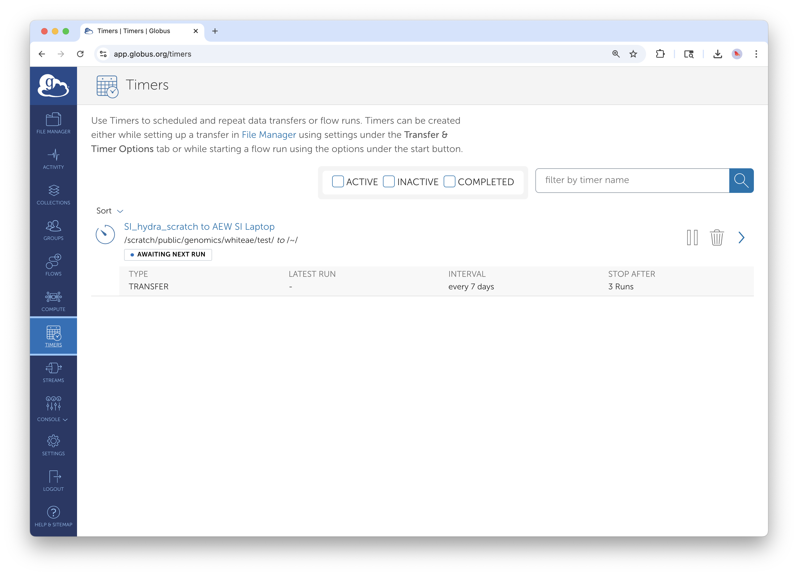
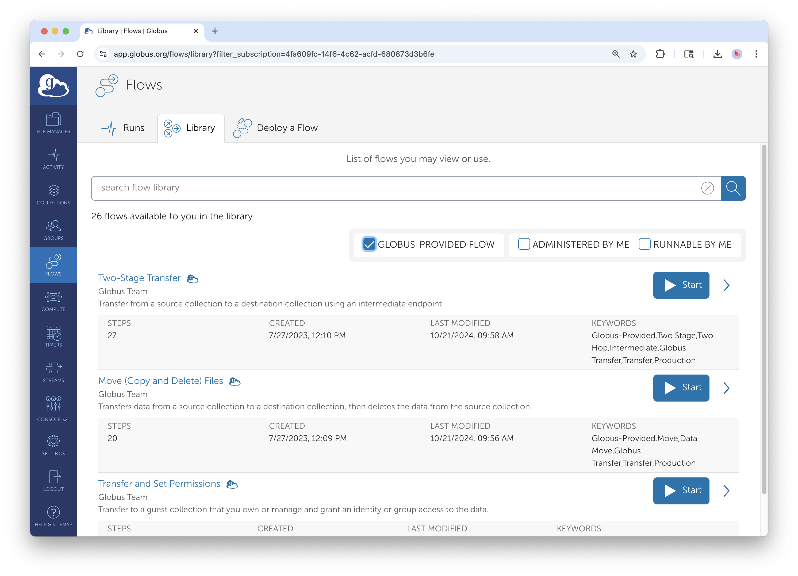

# Advanced Globus Features

## Executive Summary

This guide covers Globus power-user features that automate and optimize data workflows. You'll learn when to use **Sync** instead of Transfer, how to schedule **recurring transfers**, and how to build **Globus Flows** for multi-step automated workflows. These capabilities transform Globus from a manual file-copying tool into an automated data pipeline.

### Who This Guide Is For

This guide assumes you're comfortable with basic Globus operations (covered in Guide 1) and are ready to:

- Automate repetitive transfer tasks
- Keep directories synchronized across systems
- Build workflows that run without manual intervention
- Optimize transfer performance for your specific needs

## Sync vs. Transfer: Choosing the Right Tool

### Understanding the Difference

Both Transfer and Sync copy files from source to destination, but they handle existing files differently.

| Operation | What It Does | Best For |
|-----------|--------------|----------|
| **Transfer** | Copies all selected files, overwriting any existing files at the destination | One-time data moves; initial uploads; replacing outdated datasets |
| **Sync** | Copies only new or modified files; leaves unchanged files alone | Ongoing synchronization; incremental backups; collaborative folders |

Think of it this way: **Transfer** is "copy everything I selected." **Sync** is "make the destination match the source."

### When to Use Transfer

Use standard Transfer when:

- Moving data for the first time to a new location
- Replacing an entire dataset with a new version
- You want to overwrite everything regardless of what's already there
- You're moving data to an empty destination

### When to Use Sync

Use Sync when:

- You're updating a destination that already has some of the files
- Running regular backups where most files haven't changed
- Collaborating on a shared folder that multiple people update
- Resuming an interrupted transfer (Sync will skip already-completed files)

**Example scenario:** You maintain a project folder on your laptop and periodically sync it to Hydra. Each week, only a few files change. Using Sync means only those changed files transfer—saving time and bandwidth.

### How to Initiate a Sync


*The Transfer & Timer Options panel. Select "sync" to enable synchronization mode.*

1. Set up your source and destination as you would for a normal transfer
2. Click **Transfer & Timer Options** (between the two panels)
3. Under **Transfer Options**, select **apply sync level**
4. Choose your desired sync behavior (see next section)
5. Click **Start**

### Sync Behavior Options

When you enable Sync, you can fine-tune how Globus detects changes:

| Option | Behavior |
|--------|----------|
| **Modification time** | Compare timestamps; transfer if source is newer (default) |
| **Checksum** | Calculate file hashes; transfer if content differs (slower but more accurate) |
| **File size** | Compare sizes; transfer if different (fast but less reliable) |

For most workflows, the default (modification time) works well. Use checksum verification for critical data where you need to guarantee integrity.

### Sync Limitations

Sync has an important limitation: **it only adds and updates files at the destination; it doesn't delete files that no longer exist at the source.** If you delete a file from your source folder, that file will remain at the destination.

For true two-way synchronization or deletion handling, you'll need Globus Flows (covered below).

## Scheduling Transfers and Syncs

### Why Schedule Transfers?

Scheduling lets you:

- Run large transfers during off-peak hours when networks are faster
- Set up regular backups that run automatically
- Coordinate data movement around processing schedules
- Avoid tying up bandwidth during working hours

### One-Time Scheduled Transfers

To run a transfer at a specific future time:



*Schedule a transfer to run at a specific date and time.*

1. Set up your transfer as normal
2. Click **Transfer & Timer Options**
3. Under **Schedule Start**, select the date and time
4. Click the **teal clock button** (not the blue Start button) to schedule

The transfer will start automatically at the specified time. You'll receive an email notification when it begins and when it completes.

### Recurring Transfers (Timers)

For automated, repeating transfers like nightly backups or weekly syncs use Globus Timers.


*Configure a recurring transfer with customizable frequency.*

1. Set up your source, destination, and any options (like Sync)
2. Click **Transfer & Timer Options**
3. Enable **Repeat** and configure the schedule:
   - Frequency: hourly, daily, weekly, or custom interval
   - Start time: when the first transfer should run
   - End date: when to stop recurring (optional)
4. Click the **teal clock button** to create the Timer

### Managing Timers

View and manage your scheduled recurring transfers from the **Timers** page:



*The Timers tab shows all your scheduled recurring transfers.*

1. Go to **Activity** in the left sidebar
2. Click the **Timers** tab
3. Here you can:
   - View upcoming scheduled runs
   - Pause or resume timers
   - Delete timers you no longer need
   - See the history of past runs

### Practical Scheduling Patterns

**Nightly backup:** Sync your project folder from a workstation to the SI Data Center every night at 2 AM when the network is quiet.

**Weekly archive:** Transfer completed datasets to long-term storage every Friday afternoon.

**Hourly sync:** Keep a shared collaboration folder synchronized between STRI and the Data Center.

**Field season automation:** Schedule daily syncs from a field station laptop during your research season, with an end date when the season concludes.

## Globus Flows: Automated Multi-Step Workflows

### What Are Flows?

Globus Flows chain multiple actions into automated workflows. Instead of manually running a transfer, then cleaning up old files, then notifying collaborators. You define a Flow that does all of this automatically.

Flows can include:
- Transfer or Sync operations
- Delete operations
- Conditional logic
- Email notifications
- Integration with external services

### Accessing Flows



*The Flows section in the left sidebar gives access to workflow automation.*

Click **Flows** in the left sidebar to access the Flows interface. Here you can:

- Browse available Flow templates
- Run Flows that have been shared with you
- Create new Flows (requires additional permissions)
- Monitor running and completed Flow executions

### Example Flow: Transfer and Delete

A common workflow: transfer files from an instrument staging area or incoming folder to permanent storage, then delete the originals to free up space.

**Without Flows:** You manually transfer, wait for completion, verify success, then manually delete the source files.

**With a Flow:** Define a "Transfer and Delete" Flow that automatically:
1. Transfers all files from source to destination
2. Verifies the transfer completed successfully
3. Deletes the original files from the source
4. Sends you an email confirmation


*Running a Transfer and Delete Flow. Specify source, destination, and notification preferences.*

**To run this Flow:**

1. Go to **Flows** in the sidebar
2. Find the "Transfer and Delete" template (or one shared by your administrator)
3. Click **Run**
4. Specify your source collection and path
5. Specify your destination collection and path
6. Configure notification preferences
7. Click **Start Flow**

The Flow runs asynchronously. You'll receive email notifications as each step completes.

### Flow Safety Considerations

Flows involving deletion are powerful but require caution:

- **Test first:** Run your Flow on a small test dataset before applying to critical data
- **Verify destinations:** Double-check that your destination path is correct—deletions from source only make sense if the data safely arrived at the destination
- **Understand the order:** The Flow won't delete source files unless the transfer succeeds
- **Keep notifications on:** Email alerts let you know if something goes wrong

### Custom Flows

The ability to create custom Flows is available for all Smithsonian staff. For complex automation needs, contact SI-Globus@si.edu to discuss options.

## Advanced Transfer Options

Beyond Sync and scheduling, Globus offers several options to optimize and control transfers.

### Accessing Transfer Options


*The full Transfer & Timer Options panel with advanced settings.*

Click **Transfer & Timer Options** between the panels to access all settings.

### Verification and Integrity

| Option | Purpose |
|--------|---------|
| **Skip file integrity verification after transfer** | Skip calculating checksums to confirm files transferred correctly (NOT recommended) |
| **Encrypt transfer** | Forces encryption in transit (enabled by default for most institutional endpoints) |
| **Preserve source file modification times** | Keeps original timestamps on copied files |

### Handling Existing Files

| Option | Purpose |
|--------|---------|
| **Overwrite files** | Replace existing files at destination (default behavior) |
| **Skip files that already exist** | Don't transfer files if a file with the same name exists |
| **Delete files on destination not in source** | Make destination exactly match source (use carefully) |

### Performance Tuning

| Option | Purpose |
|--------|---------|
| **Fail on quota errors** | Stop immediately if destination storage is full |
| **Skip source errors** | Continue transfer even if some files can't be read (useful for partially corrupted sources) |

### Transfer Labels

Adding a descriptive label to your transfer makes it easier to find in your Activity history:

- "2025-03 Pollen Images - Costa Rica Site A"
- "Weekly backup - NMAH workstation"
- "Genomics data for collaborator review"

Labels are especially helpful when you run many transfers or need to find a specific historical transfer.

## Real-World Workflow Examples

### Example 1: Instrument Data Pipeline

**Scenario:** A microscope generates large image files that need to move to Hydra for processing, then to DAMS for archiving.

**Solution:**
1. Set up a **nightly Timer** that syncs from the instrument staging folder to Hydra
2. After processing completes, use a **second Timer** to transfer results to DAMS storage
3. Use a **Transfer and Delete Flow** to clean up the staging folder weekly

### Example 2: Collaborative Research Sync

**Scenario:** Teams at NMNH and STRI work on shared datasets that need to stay synchronized.

**Solution:**
1. Create a **recurring Sync** from NMNH to STRI (daily at midnight)
2. Create a **second recurring Sync** from STRI to NMNH (daily at 6 AM)
3. Both syncs use "modification time" to detect changes

**Note:** This pattern works for files that are only edited on one side at a time. If the same file might be edited at both locations simultaneously, you'll need a more sophisticated conflict-resolution strategy.

### Example 3: Field Season Automation

**Scenario:** Researchers collect data during a 3-month field season and need regular backups to institutional storage.

**Solution:**
1. Install **Globus Connect Personal** on the field laptop (see Guide 3)
2. Create a **daily Timer** that syncs the data collection folder to SI Data Center storage (e.g., Hydra)
3. Set the Timer end date for when the field season concludes
4. Enable email notifications to confirm each sync completes

## Troubleshooting Advanced Features

### Timer Issues

**Issue: Timer runs but no files transfer**
- **Cause:** Source folder is empty, or Sync detects no changes
- **Solution:** Check that new/modified files exist in the source; verify the Timer is pointed at the correct path

**Issue: Timer stopped running**
- **Cause:** Timer expired (reached end date) or was paused
- **Solution:** Check the Timers tab in Activity; create a new Timer if needed

**Issue: Timer runs at unexpected time**
- **Cause:** Timezone mismatch
- **Solution:** Verify the timezone setting in your Globus account preferences

### Sync Issues

**Issue: Sync transfers files that haven't changed**
- **Cause:** Modification times differ between source and destination (common when copying from certain filesystems)
- **Solution:** Use checksum-based sync for more accurate change detection

**Issue: Deleted files reappear at destination**
- **Cause:** Standard Sync doesn't delete; a subsequent Sync re-copies the files
- **Solution:** Use "delete files not at source" option carefully, or use a Transfer and Delete Flow

### Flow Issues

**Issue: Flow fails partway through**
- **Cause:** Permissions issue, endpoint offline, or network interruption
- **Solution:** Check the Flow execution details for specific error messages; verify all endpoints are accessible; re-run the Flow

**Issue: Can't find expected Flow templates**
- **Cause:** Flows may need to be shared with you or require additional permissions
- **Solution:** Contact SI-Globus@si.edu to resolve access issues

## Quick Reference

### Sync vs. Transfer Decision Tree

```
Do files already exist at the destination?
├── No → Use Transfer
└── Yes → Have most files changed since the last copy?
    ├── Yes → Use Transfer (overwrites everything)
    └── No → Use Sync (only updates changed files)
```

### Timer Scheduling Cheat Sheet

| Use Case | Frequency | Good Start Time |
|----------|-----------|-----------------|
| Nightly backup | Daily | 2:00 AM |
| Weekly archive | Weekly | Friday 5:00 PM |
| Hourly sync | Hourly | Top of the hour |
| End-of-day sync | Daily | 6:00 PM |

### Key URLs

- **Globus Web App:** [app.globus.org](https://app.globus.org)
- **Flows Documentation:** [docs.globus.org/guides/flows/](https://docs.globus.org/guides/flows/)
- **Timer Documentation:** [docs.globus.org/guides/timers/](https://docs.globus.org/guides/timers/)

### Smithsonian Support Contacts

- **General Globus Support:** SI-Globus@si.edu
- **Custom Flows Requests:** SI-Globus@si.edu
- **Hydra Globus Support:** SI-HPC@si.edu
- **STRI Data Transfer Server:** STRIhelp@si.edu

---

*For help with advanced Globus features, contact SI-Globus@si.edu. For complex workflow automation needs, the Globus team can discuss custom Flow development options.*
